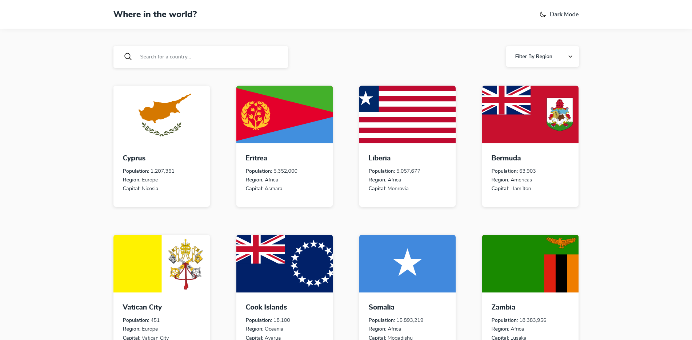

# Frontend Mentor - REST Countries API with color theme switcher solution

This is a solution to the [REST Countries API with color theme switcher challenge on Frontend Mentor](https://www.frontendmentor.io/challenges/rest-countries-api-with-color-theme-switcher-5cacc469fec04111f7b848ca). Frontend Mentor challenges help you improve your coding skills by building realistic projects.

## Table of contents

- [Frontend Mentor - REST Countries API with color theme switcher solution](#frontend-mentor---rest-countries-api-with-color-theme-switcher-solution)
  - [Table of contents](#table-of-contents)
  - [Overview](#overview)
    - [The challenge](#the-challenge)
    - [Screenshot](#screenshot)
    - [Links](#links)
  - [My process](#my-process)
    - [Built with](#built-with)
    - [What I learned](#what-i-learned)
  - [Acknowledgments](#acknowledgments)

## Overview

### The challenge

Users should be able to:

- See all countries from the API on the homepage
- Search for a country using an `input` field
- Filter countries by region
- Click on a country to see more detailed information on a separate page
- Click through to the border countries on the detail page
- Toggle the color scheme between light and dark mode _(optional)_

### Screenshot



### Links

- Solution URL: [Add solution URL here](https://your-solution-url.com)
- Live Site URL: [Add live site URL here](https://your-live-site-url.com)

## My process

### Built with

- Semantic HTML5 markup
- CSS custom properties
- Flexbox
- CSS Grid
- Mobile-first workflow
- [React](https://reactjs.org/)
- [React Router](https://reactrouter.com/en/main)

### What I learned

since we can't style `<option>` I decided to make a custom select menu that works like the native `<select>` tag, It supports:

- arrow up/down navigation
- when select menu is open preselected element gets focus if it doesn't exists then first element or gets focus
- when Escape or Tab key are pushed it closes the menu while giving focus to menu button

```js
export default function SelectMenu() {
  const {
    selectedOption,
    filterExpanded,
    selectOptions,
    handleClick,
    handleKeyDown,
  } = useSelectMenu();
  return (
    <div aria-label="filter" className="select-menu">
      <button
        className="select-menu__button"
        type="button"
        aria-expanded={filterExpanded}
        aria-controls="filter-menu"
        onClick={handleClick}
      >
        {selectedOption === '' ? 'Filter by Region' : selectedOption}
        <span
          className="select-menu__icon invertIcon"
          style={{
            rotate: filterExpanded && '180deg',
          }}
        ></span>
      </button>
      <ul id="filter-menu" role="select" className="select-menu__option-group">
        {selectOptions.map((option) => (
          <li
            key={option}
            className="select-menu__options"
            role="option"
            tabIndex={filterExpanded ? '0' : '-1'}
            data-value={option}
            aria-selected={selectedOption === option}
            onKeyDown={handleKeyDown}
            onClick={handleClick}
          >
            {option}
          </li>
        ))}
      </ul>
    </div>
  );
}
```

Frontend Mentor - [@hassaneljebyly](https://www.frontendmentor.io/profile/hassaneljebyly)
Twitter - [@HassanElJebyly](https://twitter.com/hassaneljebyly)

## Acknowledgments

- built the search form following [a11ymatters](https://www.a11ymatters.com/pattern/accessible-search/) guidelines

- the selection menu was built with the help of [ux.stackexchange](https://ux.stackexchange.com/questions/145490/what-accessibility-pattern-for-filter-sort-dropdown), [w3](https://www.w3.org/WAI/tutorials/menus/flyout/) and [w3 disclosure patterns](https://www.w3.org/WAI/ARIA/apg/patterns/disclosure/)
